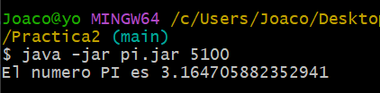
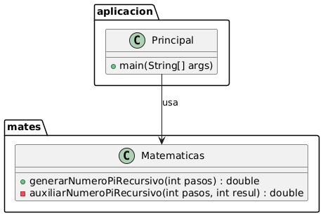

# PI recursivo

## Descripción

Este programa permite obtener una aproximacion al número pi a traves del método Motencarlo. Para ello toma como argumento el numero de puntos a generar y procede a mostrar por pantalla el resultado de la aproximacion.

## Instalación

Requesitos previos: Tener instalado java. Para comprobar nuestra instalacion ejecutaremos el comando "java --version"
Para instalar el programa descarga y mueve al directorio pertinente el archivo .jar. Una vez preparado hay que abrir la consola de 
comandos y movernos hasta el directorio. Una vez dentro ejecutar el siguiente comando: "-java -jar pi.jar (PASOS)" que procedera a ejecutar
el codigo.

## Ejemplos de uso

Debemos ejecutar el comando indicado en el apartado de instalacion sustituyendo (PASOS) por el numero deseado.

## Estructura

El código esta dividido en dos paquetes. Un primer paquete llamado mates con la clase Matematicas que se encarga de calcular nuestra aproximacion al número pi. La otra parte de nuestra estructura se trata del paquete aplicacion con la clase Principal que consta de nuestro método main donde se implementa el codigo desarrollado en Matematicas.

## Contribuciones

Proyecto desarrollado por Joaquin de Vicente Abad.

## Licencia
Este proyecto está licenciado bajo la Apache License 2.0.