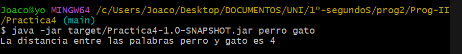
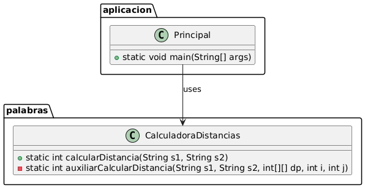

# Distancia de edicion entre dos palabras mediante el método de Dan Jurafsky

## Descripción

Este programa permite conocer la distancia que hay entre dos palabras. Partiendo de una palabra añadiremos, eliminaremos o modificaremos los caracteres
para llegar a nuestro destino. Como resultado obtenemos el numero de operaciones. El método usado es el de Dan Jurafsky.

## Instalación

Requesitos previos: Tener instalado java. Para comprobar nuestra instalacion ejecutaremos el comando "java --version"

Para instalar el programa descarga y mueve al directorio pertinente el archivo .jar. Una vez preparado hay que abrir la consola de 
comandos y movernos hasta el directorio. Una vez dentro ejecutar el siguiente comando: 
"-java -jar target/Practica4-1.0-SNAPSHOT String s1  String s2"   que procedera a ejecutar el codigo.

## Ejemplos de uso

Debemos ejecutar el comando indicado en el apartado de instalacion sustituyendo tanto s1 como s2 por nuestras palabras, partiendo de s1 y llegando a s2.

## Estructura

El código esta dividido en dos paquetes. Un primer paquete llamado palabras con la clase Calculadora distancias que se encarga de calcular nuestra distancia entre palabras a traves del método auxiliar. La otra parte de nuestro codigo se trata del paquete aplicacion con la clase Principal que consta de nuestro método main donde se implementa el codigo desarrollado en palabras.

## Contribuciones

Proyecto desarrollado por Joaquin de Vicente Abad.

## Licencia
Este proyecto está licenciado bajo la Apache License 2.0.