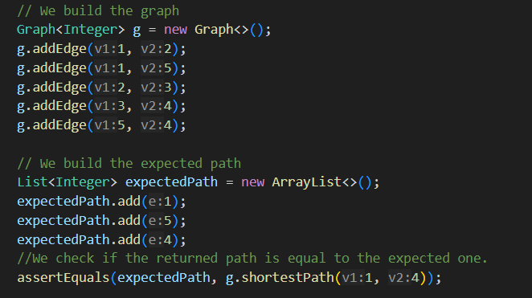
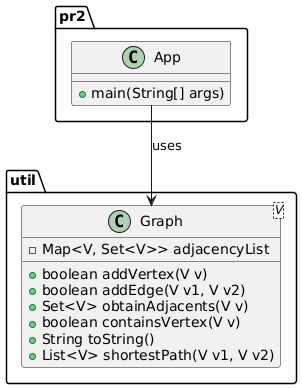

# Creacion de una clase capaz de calcular el camino mas corto entre los nodos de un grafo.

## Descripción

Este programa permite conocer el recorrido minimo que hay entre dos nodos cualesquiera. Partiendo de un nodo se crea una cola donde
añadimos los nodos adyacentes no visitados hasta llegar al destino.

## Instalación

Requesitos previos: Tener instalado java. Para comprobar nuestra instalacion ejecutaremos el comando "java --version"

## Ejemplos de uso

El programa contiene un test con el que probar su funcionalidad y en el que se muestra la creacion de nodos y grafos.

## Estructura

El código esta dividido en dos paquetes. Un primer paquete pr2 que contiene el metodo principal carente de codigo significativo.
Un segundo paquete llamado util donde se encuentra nuestra clase grafo y sus métodos asociados.

## Contribuciones

Proyecto desarrollado por Joaquin de Vicente Abad.

## Licencia
Este proyecto está licenciado bajo la Apache License 2.0.